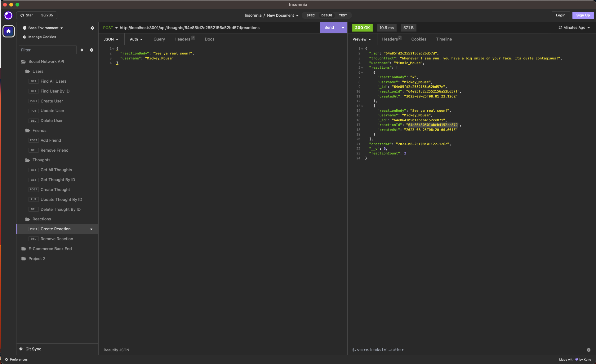

 🧑‍💻 Social Network API
  
  
  ## ℹ️ Description:
  An API for a social network web application where users can share their thoughts, react to friends’ thoughts, and create a friend list.
  ## 📸
  
  
  ## 🤔 Questions:
  
  For any additional questions:
  
  📧 Email:
  djamiranda@gmail.com
  
  🔗 GitHub:
  [https://github.com/djamiranda](https://github.com/djamiranda)
  
  💻 Repo:
  [https://github.com/djamiranda/Social-Network-API](https://github.com/djamiranda/Social-Network-API)

  🎬 Video:
  [Google Drive Link](https://drive.google.com/file/d/1ZPMD9ABdLppvVLGowBvhQO4h7VRGKzjl/view?usp=sharing)